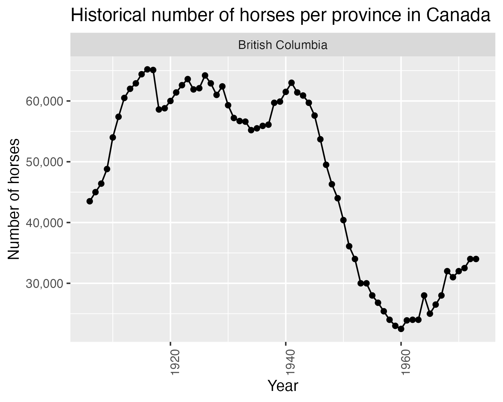

```{r setup, include=FALSE}
knitr::opts_chunk$set(echo = FALSE)
library(tidyverse)
library(knitr)
library(kableExtra)
```

## Aim

This project explores the historical population of horses in Canada between 1906 and 1972 for each Province.


## Data

```{r load data, include = FALSE}
horse_pop <- read_csv("../data/00030067-eng.csv")
horse_pop <- filter(horse_pop,
                    DATE == "At June 1 (x 1,000)",
                    GEO != "Canada")
horse_pop$Value <- horse_pop$Value * 1000
```

Horse population data were sourced from the [Government of Canada's Open Data website](http://open.canada.ca/en/open-data). Specifically, these two sources were used:

- [Horses, number on farms at June 1 and at December 1](http://open.canada.ca/data/en/dataset/43b3a9b3-3842-45e7-8bc8-c4c27b9462ab)
- [Horses, number on farms at June 1, farm value per head and total farm value](http://open.canada.ca/data/en/dataset/b374f60b-9580-44dc-83f6-c0a850c15f30)

## Methods

The R programming language and the following R packages were used to perform the analysis: knitr and tidyverse [@tidy]. The code used to perform the analysis and create this report can be found here: https://github.com/ttimbers/equine_numbers_value_canada_rmd.


## Results

```{r plot horses, fig.width=10, fig.height=3}
horse_plot <- ggplot(horse_pop, aes(x = Ref_Date, y = Value)) +
  geom_point() +
  geom_line() +
  xlab("Year") +
  ylab("Number of horses") +
  ggtitle("Historical number of horses per province in Canada") +
  facet_grid(~GEO) +
  scale_y_continuous(labels = scales::comma) +
  theme(axis.text.x = element_text(angle = 90, hjust = 1))
horse_plot
```

We can see from the visualisation above that Ontario, Saskatchewan and Alberta have had the highest horse populations in Canada. All provinces have had a decline in horse
populations since 1940. This is likely due to the rebound of the Canadian automotive
industry after the Great Depression and the Second World War. An interesting follow-up visualization would be car sales per year for each Province over the time period visualised above to further support this hypothesis. 

Next we look at the range of the number horses for each provinces at any time point between `r min(horse_pop$Ref_Date)` and `r max(horse_pop$Ref_Date)`:

```{r max horse table}
max_horses <- horse_pop %>% 
  select(GEO, Value) %>% 
  rename(Province = GEO) %>% 
  group_by(Province) %>% 
  summarize(Maximum = max(Value),
            Minimum = min(Value))
knitr::kable(max_horses, caption = "Table.1 Hourse population in Canada") |> 
  kableExtra::kable_styling(full_width = FALSE)
```

Below we zoom in and look at the province of `r params$province`:

```{r plot province, fig.align='center', fig.cap="Figure.2 Provinces", fig.height=4, fig.width=5, message=FALSE, warning=FALSE}
province_plot <- horse_pop %>% 
  filter(GEO == params$province) %>% 
  ggplot(aes(x = Ref_Date, y = Value)) +
  geom_point() +
  geom_line() +
  xlab("Year") +
  ylab("Number of horses") +
  ggtitle("Historical number of horses per province in Canada") +
  facet_grid(~GEO) +
  scale_y_continuous(labels = scales::comma) +
  theme(axis.text.x = element_text(angle = 90, hjust = 1))
province_plot

ggsave("province_plot.png")

```
## Reading an existing plot
```{r out.height='200px', out.width='200px'}

```

## Notes
Rscript -e "rmarkdown::render('doc/hist_horse_pop.Rmd', output_format = 'pdf_document', params = list(province = 'Alberta'))"


## References

